## Hi there, I’m Diogo Ribeiro

Senior Data Scientist • Mathematician • based between the United Kingdom and Portugal

> “Knowledge is knowing a tomato is a fruit; wisdom is not putting it in a fruit salad.”  
> — Miles Kington

I build production systems that turn messy data into decisions.  
Across logistics, health and engineering I’ve focused on lean models, clean code, and reproducible pipelines.  
Lately I’ve been shipping **sensor analytics, survival data tools, drift / anomaly detection**, and **LLM-powered reporting** that help teams reason about time series and text in real time.

---

## 🧠 Areas of Expertise

- **Machine Learning**  
  Supervised & unsupervised learning, anomaly detection, time-series forecasting, optimisation.

- **Graph & Network Analysis**  
  Social / interaction networks, graph theory, dynamic metrics, community structure.

- **Big Data Analytics**  
  Pattern discovery in marketing, logistics, and urban systems (structured & unstructured data).

- **Mathematical Modelling**  
  Differential equations, statistical inference, numerical methods for complex systems.

- **Sustainability & Urban Systems**  
  Energy optimisation, smart environments, traffic prediction.

---

## 🛠️ Technical Skills

- **Programming** — Python (typed, NumPy-first), SQL, R, TypeScript, Bash/Zsh, C, Fortran  
- **ML / Data** — NumPy, Pandas, Polars, FireDucks; scikit-learn, XGBoost / LightGBM; PyTorch, TensorFlow; statsmodels  
  Focus: **time series**, **anomaly detection**, **GLMs / IRLS**, **robust statistics**, **survival / event-time data**  
- **Data Eng & Streaming** — Apache Kafka, Flink, Spark, Databricks; Arrow / Parquet; Apache Iceberg (lakehouse)  
- **Cloud & Storage** — AWS S3, DynamoDB; PostgreSQL, MySQL, SQLite; MongoDB, InfluxDB  
- **DevEx & CI/CD** — Docker; GitHub Actions, Jenkins; Poetry; pre-commit (ruff, mypy, pytest-cov); semantic versioning  
- **Testing & Quality** — pytest, coverage, property-based tests (hypothesis); static typing; security linting (bandit)

---

## 🔍 Research Interests

- **Health Data Science** — real-time analytics from wearables / sensors, personalised baselines, clinical interpretability  
- **Graph Theory & Social Networks** — interaction graphs, diffusion / contagion models, community & role discovery  
- **Big Data & Marketing Analytics** — uplift modelling, sequence-aware attribution, lifetime value with drift control  
- **Sustainability & Energy Systems** — demand forecasting, optimisation under constraints, carbon-aware scheduling  
- **Smart Environments & Sensor Networks** — multimodal fusion (RSSI + activations), localisation, reliability modelling  
- **Behavioural & Labour Economics** — micro-behavioural patterns, incentive effects, heterogeneity and fairness  
- **Inequality & Sustainable Development** — distributional metrics, policy simulation, causal and counterfactual analysis  

> Now: real-time anomaly detection; Bayesian filtering / HMMs for indoor localisation; robust regression & GLMs (IRLS); LLM-assisted reporting with audit trails; survival data generators and drift-aware evaluation.

---

## 📌 Pinned Projects (selection)

- **abx-next** — A/B experimentation utilities: CUPED / CUPAC hooks, triggered analysis, SRM guardrails, switchback helpers, and power simulations.  
- **genSurvPy** — Survival-data generators (AFT / CPHM, censored data), reproducible simulations, and validation utilities.  
- **smart-todo-action** — GitHub Action that extracts TODOs, groups by semantic labels / tags / metadata, and opens issues / changelogs.  
- **navier-stokes-solvers** — CFD solvers for the 2D / 3D Navier–Stokes equations (finite-difference & spectral variants), with buildable CLI targets and basic tests.  
- **heavytails** — Utilities for heavy-tailed modelling and inference (tail index estimation, Pareto-like fits, EVT diagnostics).

*(I also work on outlier detection, volatility, genetic algorithms, and drift libraries in other repos — some still private.)*

---

## 🎓 Publications / Teaching

### Teaching @ESMAD

- **Introduction to Logic & Set Theory** (First Semester, 15 weeks)  
  Logic (prop / FO), sets, induction, differential & integral calculus; notes + LaTeX.

- **Linear Algebra** (Second Semester, 15 weeks)  
  Vector spaces and linear maps; matrices and determinants; eigenvalues / eigenvectors, diagonalisation; orthogonality, projections, Gram–Schmidt; least squares; SVD and PCA; numerical stability & conditioning; applications to optimisation and data science.  
  Syllabus: link · Slides (Beamer): link

- **NLP & LLM mini-workshops**  
  Prompt design, evals, lightweight retrieval, and report generation with structured → narrative transforms.

### Seminars & Workshops

- **Data Science Seminars**  
  End-to-end ML pipelines, feature engineering for time series, evaluation under drift, MLOps (CI/CD, data / versioning), and reproducible research practices.  
  Slides: link · Notebooks: link

- **Sensors & Dashboards**  
  IoT data ingestion (MQTT / Kafka), time-series storage (InfluxDB / Parquet), streaming analytics (Flink), and dashboards (Grafana / Plotly / Dash) with alerting & anomaly detection.  
  Slides: link · Demo repo: link

- **Applications of Matrices to Computational Graphics**  
  Linear transforms in 2D / 3D, homogeneous coordinates, rotations (Euler vs. quaternions), camera models & projections, shading basics; SVD / PCA for geometry processing.  
  Slides: link · Code samples: link

### Selected Writings / Demos

- Streaming analytics with Iceberg + Flink + DynamoDB — architecture notes and example pipelines.  
- Robust regression with IRLS — ψ-functions, influence diagnostics, and uncertainty reporting.  
- Time-series anomaly detection — EWMA variants, adaptive σ, and change-point alerts for sensors.

---

## ⭐ Highlights

- Interdisciplinary approach spanning computer science, mathematics, economics, and natural sciences.  
- Practical projects in IoT, automation, and environmental monitoring (Raspberry Pi + sensors).  
- Ongoing work in ML for time series, anomaly detection, survival analysis, and robust statistical modelling.

---

## 📊 GitHub Stats & Trophies

---

## 🤝 Let’s Connect and Collaborate

Thanks for visiting! I’m keen to partner with data enthusiasts, researchers, and product teams.  
Browse my projects or get in touch — happy to explore ideas and build useful things together.

[Medium](https://medium.com) · [Dev.to](https://dev.to) · [LinkedIn](https://www.linkedin.com/in/diogo-ribeiro-9094604a) · ✉️
