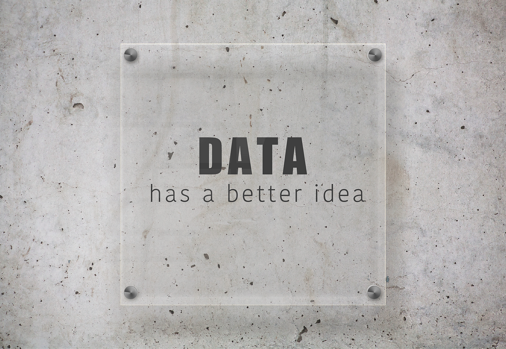

## Hi there, I’m Diogo Ribeiro
**Senior Data Scientist • Mathematician • working between the United Kingdom and Portugal**

> “Knowledge is knowing a tomato is a fruit; wisdom is not putting it in a fruit salad.”
> — Miles Kington

I build production systems that turn messy data into clear decisions. Two decades across logistics, health, and engineering have taught me the value of lean models, clean code, and reproducible pipelines. More recently, I have been building NLP and statistical modelling solutions that help teams reason about text and time series in real time.

  

---

## Areas of Expertise

- **Machine Learning**
  Supervised and unsupervised learning, anomaly detection, time-series forecasting, and optimisation.
- **Graph & Network Analysis**
  Social and interaction networks, graph theory, dynamic metrics, and community structure.
- **Big Data Analytics**
  Pattern discovery across marketing, logistics, and urban systems using both structured and unstructured data.
- **Mathematical Modelling**
  Differential equations, statistical inference, and numerical methods for complex systems.
- **Sustainability & Urban Systems**
  Energy optimisation, smart environments, and traffic prediction.

---

## Technical Skills

- **Programming** — Python (typed, NumPy-first), SQL, R, TypeScript, Bash/Zsh, C, Fortran
- **ML / Data** — NumPy, Pandas, Polars, FireDucks; scikit-learn, XGBoost/LightGBM; PyTorch, TensorFlow; Statsmodels
  _Focus:_ time series, anomaly detection, GLMs/IRLS, and robust statistics
- **Data Eng & Streaming** — Apache Kafka, Flink, Spark, Databricks; Arrow/Parquet; Apache Iceberg (lakehouse)
- **Cloud & Storage** — AWS S3, DynamoDB; PostgreSQL, MySQL, SQLite; MongoDB, InfluxDB
- **DevEx & CI/CD** — Docker; GitHub Actions, Jenkins; Poetry; pre-commit (ruff, mypy, pytest-cov); semantic versioning
- **Testing & Quality** — pytest, coverage, property-based tests (hypothesis); static typing; security linting (bandit)

---

## Research Interests

- **Health Data Science** — real-time analytics from wearables and sensors, personalised baselines, and clinical interpretability
- **Graph Theory & Social Networks** — interaction graphs, diffusion and contagion models, community detection, and role discovery
- **Big Data & Marketing Analytics** — uplift modelling, sequence-aware attribution, and lifetime value under drift
- **Sustainability & Energy Systems** — demand forecasting, optimisation under constraints, and carbon-aware scheduling
- **Smart Environments & Sensor Networks** — multimodal fusion (RSSI + activations), localisation, and reliability modelling
- **Behavioural & Labour Economics** — micro-behavioural patterns, incentive effects, heterogeneity, and fairness
- **Inequality & Sustainable Development** — distributional metrics, policy simulation, and causal or counterfactual analysis

> **Now:** real-time anomaly detection; Bayesian filtering/HMMs for indoor localisation; robust regression and GLMs (IRLS); LLM-assisted reporting with audit trails; **abx-next** (modern A/B experimentation utilities).

---

## Live Dashboards

- **Portugal Economic Indicators Dashboard**
  A macroeconomic dashboard for Portugal with historical context across GDP, inflation, labour markets, external balance, and public finances, with interactive time-series views and comparisons.
  [Open dashboard](https://portugal-econ-dashboard.vercel.app/)

- **NASDAQ Stock Analytics Dashboard**
  Focused analytics for a selected set of NASDAQ stocks, covering prices, returns, volatility, and technical indicators through exploratory charts for screening and monitoring.
  [Open dashboard](https://nasdaq-dashboard-sigma.vercel.app/)

---

## Pinned Projects

- **abx-next** — A/B experimentation utilities with CUPED/CUPAC hooks, triggered analysis, SRM guardrails, switchback helpers, and power simulations.
  [repo](https://github.com/DiogoRibeiro7/abx-next)

- **genSurvPy** — Survival-data generators for AFT/CPHM settings, censored data, reproducible simulations, and validation utilities.
  [repo](https://github.com/DiogoRibeiro7/genSurvPy)

- **smart-todo-action** — A GitHub Action that extracts TODOs, groups them by semantic labels, tags, and metadata, and opens issues or changelog entries.
  [repo](https://github.com/DiogoRibeiro7/smart-todo-action)

- **navier-stokes-solvers** — CFD solvers for the 2D and 3D Navier-Stokes equations, including finite-difference and spectral variants, with buildable CLI targets and basic tests.
  [repo](https://github.com/DiogoRibeiro7/navier-stokes-solvers)

- **heavytails** — Utilities for heavy-tailed modelling and inference, including tail-index estimation, Pareto-like fits, and EVT diagnostics.
  [repo](https://github.com/DiogoRibeiro7/heavytails)

---

## Publications / Teaching

Teaching and workshop work are an important part of how I contribute: not only by building systems, but also by translating mathematical and technical ideas into material that students, collaborators, and teams can use in practice.

### Teaching @ESMAD
- **Introduction to Logic & Set Theory (First Semester, 15 weeks)** — Logic (prop/FO), sets, induction, and **differential & integral calculus**, with an emphasis on rigorous reasoning, proof structure, and the transition from discrete foundations to continuous mathematical thinking.
- **Linear Algebra (Second Semester, 15 weeks)** — Vector spaces and linear maps; matrices and determinants; eigenvalues and eigenvectors; diagonalisation; orthogonality, projections, and Gram-Schmidt; least squares; **SVD and PCA**; numerical stability and conditioning; applications to optimisation, scientific computing, and data science.
- **NoSQL & MongoDB** — Non-relational data models, document-oriented design, indexing and aggregation in MongoDB, query patterns, modelling trade-offs, and practical work with real-world datasets.
- **NLP & LLM mini-workshops** — Prompt design, evaluation, lightweight retrieval, structured outputs, and report generation through structured-to-narrative transformations, with attention to reliability and practical use in production workflows.
- **Teaching style** — I aim to connect theory and implementation, showing not only how methods work mathematically, but also where they break, how to test them, and how to communicate results clearly.

### Seminars & Workshops
- **Data Science Seminars** — End-to-end ML pipelines, feature engineering for time series, evaluation under drift, MLOps (CI/CD, data/versioning), and reproducible research practices.
  Slides: _link_ · Notebooks: _link_
- **Sensors & Dashboards** — IoT data ingestion (MQTT/Kafka), time-series storage (InfluxDB/Parquet), streaming analytics (Flink), and dashboards (Grafana/Plotly/Dash) with alerting and anomaly detection.
  Slides: _link_ · Demo repo: _link_
- **Applications of Matrices to Computational Graphics** — Linear transforms in 2D/3D, homogeneous coordinates, rotations (Euler vs. quaternions), camera models and projections, shading basics, and **SVD/PCA** for geometry processing.
  Slides: _link_ · Code samples: _link_
- **Statistical Modelling & Experimentation** — Experimental design, metric definition, power analysis, variance reduction, SRM diagnostics, and translating empirical results into product or policy decisions.
  Notes: _link_ · Examples: _link_
- **Graph Analytics & Network Science** — Centrality, community detection, temporal networks, diffusion processes, and the use of graph-based thinking to understand complex interaction systems.
  Slides: _link_ · Code samples: _link_
- **Reproducible Analytics & MLOps** — Project structure, testing strategy, versioning, CI/CD, data quality checks, documentation, and the practical path from notebook exploration to maintainable production workflows.
  Notes: _link_ · Templates: _link_
- **Time Series, Forecasting & Anomaly Detection** — Signal decomposition, baselines, residual analysis, adaptive thresholds, change-point detection, and monitoring strategies for operational or sensor-driven systems.
  Slides: _link_ · Demo repo: _link_

### Selected Writings / Demos
- **Streaming analytics with Iceberg + Flink + DynamoDB** — Architecture notes and example pipelines.
- **Robust regression with IRLS** — ψ-functions, influence diagnostics, and uncertainty reporting.
- **Time-series anomaly detection** — EWMA variants, adaptive σ, and change-point alerts for sensor data.
- **Bayesian filtering and HMMs for indoor localisation** — Practical notes on sequential inference, uncertainty handling, and sensor fusion for real-time positioning.
- **A/B experimentation and measurement guardrails** — CUPED/CUPAC, switchbacks, triggered analysis, SRM checks, and trustworthy interpretation of experimental outcomes.
- **Survival-analysis simulation workflows** — Synthetic data generation, censoring scenarios, benchmarking, and validation-oriented experimentation.
- **Graph and network analysis demos** — Interaction networks, community structure, dynamic graph metrics, and exploratory workflows for complex relational systems.
- **Data dashboards for macroeconomic and market monitoring** — Interactive analytics products that combine historical context, decision support, and exploratory time-series visualisation.
- **LLM-assisted reporting with audit trails** — Structured data to narrative pipelines designed for traceability, reviewability, and operational use.

---

## Highlights

- Interdisciplinary work spanning computer science, mathematics, economics, and the natural sciences.
- A strong mathematical foundation applied to practical machine learning, data science, and engineering problems.
- Experience across logistics, health, engineering, analytics, and urban or environmental systems.
- A consistent focus on turning noisy, incomplete, or high-volume data into usable decisions and reproducible workflows.
- Practical projects in **IoT**, automation, and environmental monitoring using Raspberry Pi and sensor systems.
- Ongoing work in machine learning for time series, anomaly detection, and robust statistical modelling.
- Deep interest in models that are not only accurate, but also interpretable, auditable, and maintainable.
- Comfortable across the full stack of data work: data collection, modelling, evaluation, deployment, and communication.
- Strong interest in streaming systems, event-driven pipelines, and real-time analytics.
- Applied work in sensor data, localisation, reliability, and multimodal signal fusion.
- Experience building dashboards and analytical interfaces that make technical results easier to explore and act upon.
- Ongoing development of open-source tools for experimentation, simulation, and scientific or statistical computing.
- A bias toward clean code, clear abstractions, and research workflows that can be reproduced and extended.
- Interest in experimentation methodology, causal reasoning, and measurement quality in product and research settings.
- Teaching and workshop experience that bridges theory, computation, and practical problem-solving.
- Comfortable working across statistics, numerical methods, machine learning, and software engineering without treating them as separate silos.
- Interested in robust methods for high-variance, drifting, or imperfect real-world data.
- Motivated by projects that combine technical depth with concrete usefulness for teams, researchers, or decision-makers.

---

## GitHub Stats

Contribution activity across public and private work:

  

Recognition and profile trophies from GitHub community metrics:

  

---

## Let’s Connect and Collaborate

Thanks for visiting. I’m always interested in connecting with data enthusiasts, researchers, and product teams working on meaningful problems. Feel free to browse the projects above or get in touch if you would like to explore an idea together.

  
  
  
  

