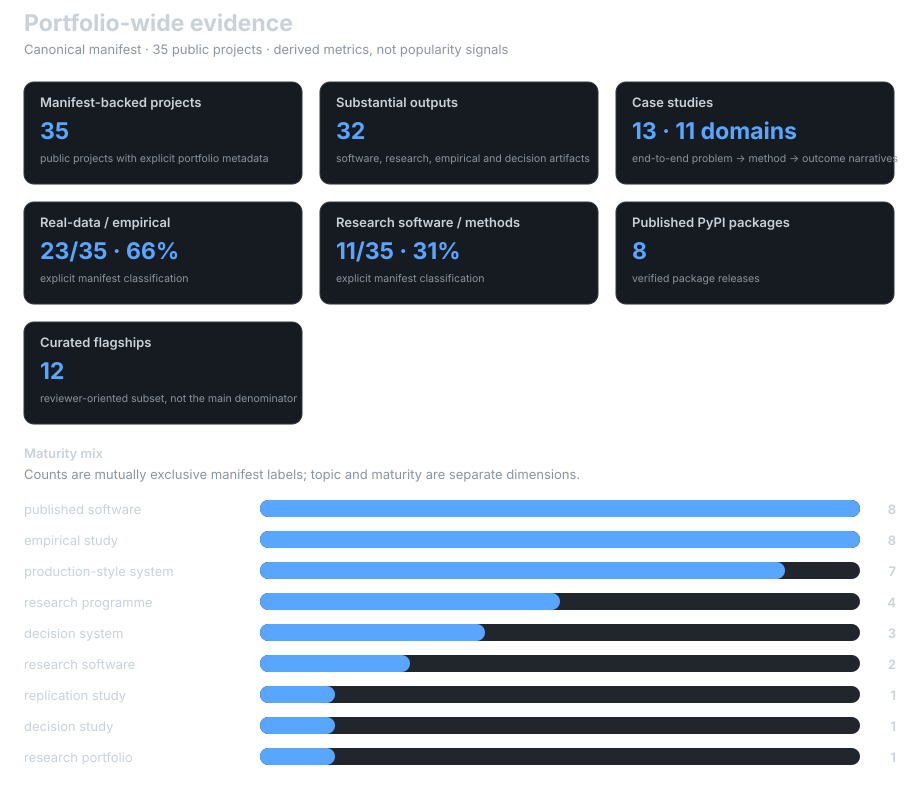
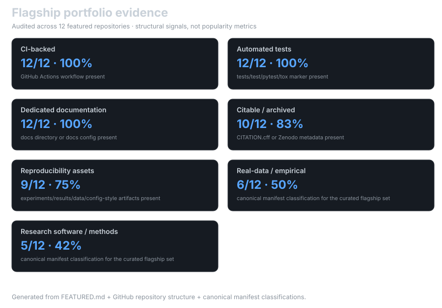
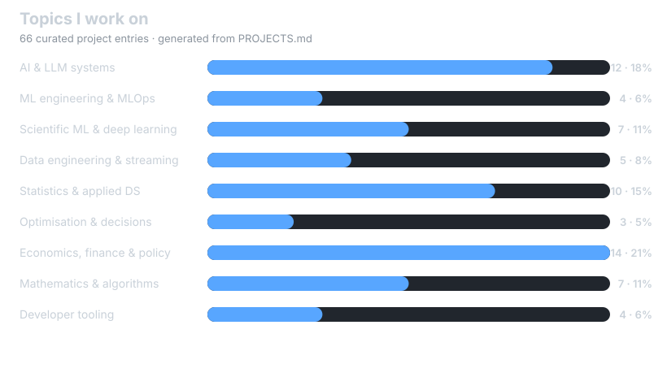
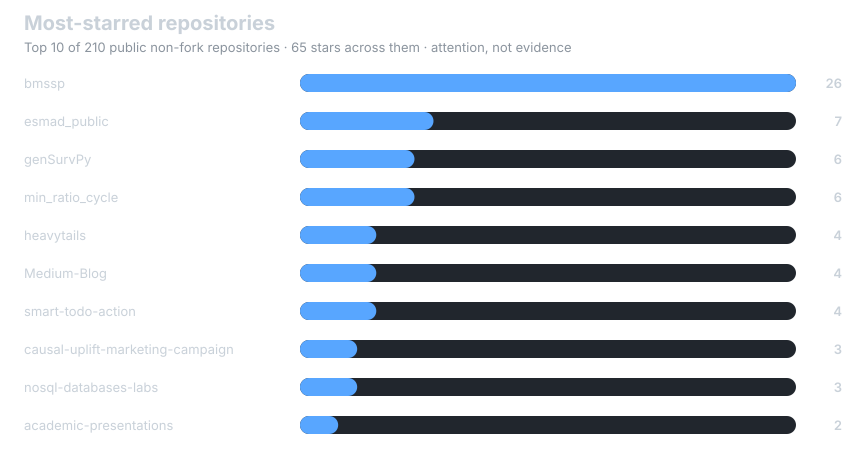

  
  
  
  
  
  
  
  
  
  

---

# Statistics

Quantitative evidence about the portfolio: scale, empirical depth, publication/output depth, reproducibility controls, delivered impact and secondary GitHub activity signals.

## Portfolio Snapshot

<!-- statistics:snapshot:start -->
| Portfolio signal | Current value |
| :-- | --: |
| Manifest-backed public projects | **35** |
| Substantial outputs | **32** |
| Case studies | **13 across 11 domains** |
| Published PyPI packages | **8** |
| Real-data / empirical projects | **23 / 35 (66%)** |
| Research software / methods | **11 / 35 (31%)** |
| Curated flagship repositories | **12** |
| Curated catalogue entries | **87** |
<!-- statistics:snapshot:end -->

These figures intentionally use different populations for different questions. The denominator rules are explicit below rather than blending repository counts, output counts and catalogue entries into one headline number.

---

## Portfolio-Wide Evidence

**Primary denominator:** the **35 public projects represented in the canonical [`data/portfolio.json`](data/portfolio.json) manifest**. This is broader than the 12-project Featured subset and narrower than every repository ever created on the account.

  

### Research and output depth

<!-- statistics:depth:start -->
| Measure | Current scope | What it means |
| :-- | --: | :-- |
| Manifest-backed public projects | **35** | Projects with explicit category, maturity and evidence metadata |
| Substantial outputs | **32** | Published software, research programmes, empirical/replication studies, and decision/engineering artifacts |
| Published PyPI packages | **8** | Verified package releases, not merely package-ready repositories |
| Real-data / empirical projects | **23 / 35 (66%)** | Explicitly classified in the manifest |
| Research software / methods | **11 / 35 (31%)** | Explicitly classified libraries, methods and research tooling |
| Case studies | **13 across 11 domains** | End-to-end problem → constraints → method → outcome narratives |
| Curated flagship projects | **12** | Reviewer-oriented subset; deliberately not used as the portfolio denominator |
<!-- statistics:depth:end -->

### Output composition

The **32 outputs** currently break down into:

<!-- statistics:outputs:start -->
| Output class | Count |
| :-- | --: |
| Published research software | **8** |
| Research and paper programmes | **5** |
| Empirical and replication studies | **9** |
| Decision and engineering artifacts | **10** |
<!-- statistics:outputs:end -->

This is an artifact count, not a repository count: a repository can legitimately produce more than one inspectable output.

---

## Delivered Impact

Professional outcomes are kept separate from repository metrics because GitHub activity is not a proxy for delivery.

| Delivered outcome | Result |
| :-- | --: |
| Reporting cost reduction | **80%** |
| Analytics processing-time reduction | **30%** |
| Inventory-value reduction through forecasting and operational optimisation | **€500K** |

---

## Flagship Engineering Controls

**Denominator:** the **12 projects in [`FEATURED.md`](FEATURED.md)**. This smaller set is used only for repository-structure auditing, where a consistent manual/automated check is useful.

  

Current structural evidence across those 12 flagships:

<!-- statistics:controls:start -->
| Control | Coverage |
| :-- | --: |
| CI workflow present | **12 / 12 (100%)** |
| Automated-test marker present | **12 / 12 (100%)** |
| Dedicated documentation | **12 / 12 (100%)** |
| Citation / archive metadata | **10 / 12 (83%)** |
| Reproducibility-style assets | **9 / 12 (75%)** |
<!-- statistics:controls:end -->

These are **structural controls**, not claims that every project is scientifically valid or production-ready. A test directory proves that tests exist, not that every possible failure mode is covered.

---

## Topic Composition

**Denominator:** the **87 curated entries in [`PROJECTS.md`](PROJECTS.md)**. Unlike the manifest dashboard above, this measures breadth of the catalogue rather than the maturity or evidential strength of each project.

  

Topic counts are therefore a **composition metric**, not a quality score and not an estimate of time spent or expertise level.

---

## Definitions and Boundaries

The page intentionally uses different denominators for different questions:

<!-- statistics:boundaries:start -->
| Question | Denominator |
| :-- | :-- |
| What does the serious public portfolio contain? | **35 manifest-backed public projects** |
| What inspectable artifacts has it produced? | **32 output records** |
| What can a reviewer inspect end-to-end? | **13 case studies across 11 domains** |
| How strong are repository controls on the curated front page? | **12 flagship repositories** |
| Where is the broad catalogue concentrated? | **87 PROJECTS.md entries** |
<!-- statistics:boundaries:end -->

Keeping those populations separate avoids a common portfolio-statistics mistake: presenting one convenient subset as if it described everything.

---

## GitHub Activity and Reach

Activity and popularity are useful context, but they are deliberately separated from the evidence above. Profile views, contribution badges and trophies do not establish modelling quality, scientific validity, production reliability, reproducibility or business impact.

### Most-starred repositories

Stars record attention, not correctness, reliability or reproducibility. They sit in this section, outside the evidence tables above, for reach context only.

  

<!-- statistics:stars:start -->
| Repository | Stars |
| :-- | --: |
| [bmssp](https://github.com/DiogoRibeiro7/bmssp) | **26** |
| [esmad_public](https://github.com/DiogoRibeiro7/esmad_public) | **7** |
| [genSurvPy](https://github.com/DiogoRibeiro7/genSurvPy) | **6** |
| [min_ratio_cycle](https://github.com/DiogoRibeiro7/min_ratio_cycle) | **6** |
| [heavytails](https://github.com/DiogoRibeiro7/heavytails) | **4** |
| [Medium-Blog](https://github.com/DiogoRibeiro7/Medium-Blog) | **4** |
| [smart-todo-action](https://github.com/DiogoRibeiro7/smart-todo-action) | **4** |
| [causal-uplift-marketing-campaign](https://github.com/DiogoRibeiro7/causal-uplift-marketing-campaign) | **3** |
| [nosql-databases-labs](https://github.com/DiogoRibeiro7/nosql-databases-labs) | **3** |
| [academic-presentations](https://github.com/DiogoRibeiro7/academic-presentations) | **2** |

_Top 10 of 205 public non-fork repositories · counts fetched 2026-09-04 · ties broken alphabetically._
<!-- statistics:stars:end -->

  

 

<strong>Additional GitHub activity widgets</strong>

 

  

 

  

